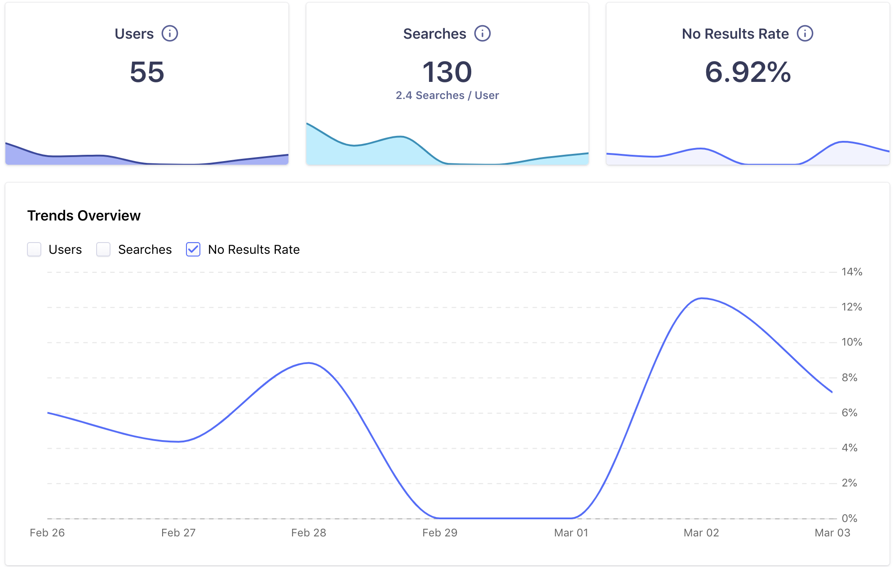

# Integrating Algolia Search Engine Into the Devhub

The Devhub made the switch to Algolia from a client-side search engine early January 2020. There
were several motivations to make the switch:

- Client Side Search had limitations in functionality
- It was difficult to gather metrics from search without having to write custom wrappers around the api
- There was a limit to how large a client side index could get before it'd bog down a user's browser

After doing some research, Algolia was was chosen because:

- the documentation was amazing
- it was very easy to integrate into our application via a `gatsby-plugin`
- the possibility of obtaining an open source licence (more on this later)
- the dashboard for Algolia is very nice and easy to use

## Algolia Pay Structure

Algolia is a __paid service__ that has different [service offerings](https://www.algolia.com/pricing/) based on your team's needs. 

The Devhub has an Algolia __Open Source Licence__. This is a free licence that allows us to utilize a small set of Algolia's service offerings - primarily search. The licence is limited and only allows a
certain number of `operations` and `search queries` per month. These are some factors that your team must be cognoscente of when looking to apply for an __Open Source Licence__.

Overall the onboarding process to Algolia was seamless and easy. Besides their great documentation, the Algolia team was very helpful and open to communicate with the Devhub Team.

## Case Study: How Algolia is Managed

Algolia is one of the moving pieces in Devhub's ___machinery___. Just like all of Devhub's machinery, it
is maintained automatically via a __pipeline__. 

Specifically, the management of the search index is automated. 

The search index follows the same life cycle as the application code. As the application code is shifted between environments (from dev to test to prod) so is the search index. The Devhub's application life cycle is `[Pull Request](https://help.github.com/en/github/collaborating-with-issues-and-pull-requests/about-pull-requests)` based. As new features or bug fixes are released, they are given their own individual development environment for testing prior to integrating to the __test__ and __production__ environments. Similarly, when a new feature is rolled out in the Devhub, a brand new index in Algolia is built at the same time as well. 

In addition to Indices being created automatically, the ___evolution___ of the index and any of the improvements we make to it (by changing settings/configuring synonyms for example) are [codified](../../../../algolia/index.json) and pushed to Algolia ___automatically___. 

## Case Study: How Algolia Has Helped the Devhub Improve Search Experience

The Algolia ___Analytics Feature___ has been immensely helpful in identifying search issues and helping us resolve them. 

When Algolia was first integrated, common themes were quickly identified for missed searches. For example, several users were searching for the terms _persistent_ or _pvc_. These terms would return zero search results. Many of the documents that are available in the Devhub were more specific then those generic search terms and covered topics such as _netapp_, _gluster_, or _block storage_. Synonyms were added to connect the dots between these terms. A few weeks later a __drop of more then 25% in no search results was observed__! In addition, cross referencing our analytics tool found that the user bounce rate for pages had decreased as well. 

Algolia also provides a list of the top searched terms. This has been useful to identify gaps in content that may be missing in the Devhub.

## Final Notes

Integrating Algolia has overwhelmingly been a success. In addition, having some analytics available allows
insights into the user experience of the Devhub. With this information, the team is able to make more informed decisions on how to best improve the product. The most challenging issue when integrating Algolia was getting started. It took several weeks to acquire the Open Source License. This was the largest blocker but after acquiring it, the integration was fairly seamless. 

