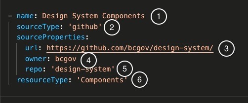

>This guide was made to help Content Contributors get their content into the DevHub. If you find any errors within this guide or would like to contribute to it, please start by [creating and issue here](https://github.com/bcgov/devhub-app-web/issues/new/choose)
> Thanks! - The DevHub Team

## The DevHub
DevHub aims to become the "Central Nervous System" for the growing gov developer community.

It will provide a comprehensive inventory of relevant internal and external documentation, open source components, services, APIs and data for internal and external developers who are building government products, or want to build their own products

### How does it work?

The DevHub works by maintaining a ***registry*** of locations to different types of content across the web. Most of this content exists inside of **Github Repositories** but it can also come from other places including **websites**.

## The Registry and Registering With DevHub

### What is the Registry Actually?

The registry is a special file within the DevHub's repository. It follows special rules and patterns that allows it to fetch content from different sources including Github and Websites.

Here is what a sample registry could look like.
```yaml
sources:
    name: The Ultimate Gov Guide to React
    attributes:
        persona: Developer
    resourceType: Documentation
    sourceProperties:
        sources:
            - sourceType: github
              sourceProperties:
                url: https://github.com/org/repo
                name: react-guide-repo
                owner: org
            - sourceType: web
              sourceProperties:
                url: https://www.reactjs.org
```

As you can see it is just a configuration file that is in `YAML` format.
### Where Is This Registry File?
> Stay tuned as we may choose to have *multiple* registry files.

It can be found at `/app-web/source-registry/registry.yml`.

### How It Works

When you register with the Devhub, several processes are kicked off to retrieve any content as defined from within the *registry file*.

Depending on the configuration of the registry as well as any extra configuration as defined within the sources themselves, the sources content will automatically be apart of the DevHub and have a static website generated for it. The way this static site is presented depends on the **template** that is used. The **template** is configured by you (or on is provided by default) within the registry. More on that later!

At the end of this process a card is manifested in the devhub that points to the generated static site for your content if applicable.


### How To Register
>We are still ironing out the best solution for registering.
In the interim please ***fork*** and ***pull request*** to the registry.

Please take a look at the [Registry Template](./registry.sample.yml)
file to get an idea of how you would add your lines of configuration to the registry.

There are **two** ways to start adding to the registry file. Adding a sources by **collection** or adding a source **individually**. They both look similar with subtle differences.

### Registering Individual Sources
> Before jumping into collections, it is best to understand how to add an individual source since most of the patterns identified here are used within a collection

A indivudal source (and collection for that matter) can be thought as having two levels of configuration.
There registry level configuration and the source level configuration. 

##### Registry Level Configuration
> Properties that exist outside of the `sourceProperties` paramater.

The following Registry Level Configurations are available:

- **name**:  The name you would like to represent your source as in the devhub. This is something user's will see so avoid naming it in an unpresentable way such as
    - bad: `name: 'my-awesome-repo'
    - good: `name: 'My Awesome Repo'
- **description**: ***To only be used by collections!*** This gives a description of the collection.
    A github repository receives this property for free based on the description of the repo as found in
    github for the repo.
- **slug**: (optional) This is the url all of your resources will show under... ie a slug of `my awesome collection` would have all resources found under the url `https://developer.gov.bc.ca/my-awesome-collection/{resource id}`.
If you choose not provide a slug, one will be made based on the ***name*** for the registry item.
> it is advised that once you have set a slug value, you avoid changing it. This is because it will break any bookmarks users have made to your resources! 
- **sourceType**: This tells DevHub how to grab information from your source
- **sourceProperties**: These are properties as required for a source type **and is not a registry level configuration**
- **resourceType**: (optional) This is a global resource type, any singular chunk of data (such as a markdown file or a yaml file or a  link to a website) that DevHubg grabs from your source can have it's individual resourceType defaulted to this value see the main readme for valid resource types.
- **attributes**:
    - **labels**: a yaml list of labels/tags for all of your sources to inherit
    - **persona**: a global persona that all sources may inherit, personas are validated against a master list, valid values are: 'Designer', 'Developer', 'Product Owner'
- **template**: this is the name of the template you want to use for your source, this will change how it renders in the devhub. The only template type available ***other than the default one*** is 'overview'
- **templateFile**: the name of the tempalte you would like to use as found in the `/app-web/src/templates/` folder
> templateFile takes priority in the event template and templateFile both exist in the registry. Also if templateFile fails to find the template specified **it will use the default one.**

There are currently **two supported source types** that can be used within the DevHub. 
- `github`
- `web`

##### Source Type Github
Used to source out 1 to many markdown files from within a repository. Github sources are ***highly configurable***, allowing for maximum customization.

##### Source Type Web
Used to source out metadata from an external website. The external website must follow at least one of the common **HTML Unfurl** Specs such as `opengraph`, `twittercard`, `oembed` etc.

##### Source Level Configurations
As mentioned, source level configurations exist within the `sourceProperties` paramater.

The following source level configurations are available for source type `github`

- **url**: the path to your repo
- **owner**: the owner of the repo    
- **repo** This is the **actual** repository name
- **branch** (optional) The branch you would like devhub to source content from
- **context** (optional) The directory or an array of directories you would like devhub to source content from the repo
- **file** (optional) The path to a particular file in the repo, if this property is used only one file will be sourced from this registration item
- **files** (optional) A list of files to retrieve from a repository
    - file1
    - docs/file2
- **ignores** (optional) a list of files or paths to ignore (replaces the need for a .devhubignore file)

> With the base mandatory configuration of a github source, all valid markdown files from the repository are sourced into the DevHub
with the exceptions of the ones that are configured not too or are ignored.

The following source level configurations are available for source type `web`

- **url**: the path to the website ie https://gatsbyjs.org
- **image**: the path to an external image
- **author**: a github username which loads an avatar as well as a link to the github user profile
- **description**: a description for the resource
- **title**: a title for the resource

#### Registering a Github Source

Here is a simple registry item for a github source.



1. Name: This is the category/title that all markdown files within the repository will be referred to as. Think of it as the common connection between each file. It is used to *group* the resources together on the main page
2. sourceType: Denotes that this source is github and directs DevHub to use the correct routine for fetching repository content

>SourceProperties: specific parameters based on the sourceType

3. url: path to the github repository
4. owner: the owner of the repository (can be a user or an organization)
5. repo: the name of the repository
6. resourceType: can be one of the 6 valid resourceTypes, this provides extra metadata to organize your content among other content that may exist within the DevHub. This property can be changed on an individual file basis by using the markdown frontmatter `resourceType` property.

#### Ignoring Files Inside of a Repository

There are **many** ways to ignore files from a repository. 

- By a `.devhubignore` file

    The `.devhubignore` is a configuration file that tells what files the devhub **should not** process. 
    This is important as you may not want to reveal documentation files such as READMEs to the devhub.


    If adding a `.devhubignore` file, please add it to the ROOT of your project.

    By default we already exclude the following files and folders so you will not to place the following within your `.devhubignore` file:

    - openshift
    - CONTRIBUTING.md
    - CODE_OF_CONDUCT.md
    - LICENSE
    - .github

    Sample .devhubignore file:

    ```
    README.md
    docs/dont_show_this.md
    ```
- By the `ignores` sourceProperty

    Instead of having to create a .devhubignore file, you can **configure** your registry within **inline ignores**.

    Let's take a look at this code example.

    ```yaml
    sources:
        -   name: Patricks Design Systen
            sourceType: 'github'
            sourceProperties:
                url: https://github.com/bcgov/devhub-app-web/
                owner: patricksimonian
                repo: 'design-system'
                ignores:
                    - components/
                    - README.md
                    #- /README.md <-- DO NOT start your ignore with a leading slash '/'
            resourceType: 'Components'
            attributes:
            labels:
                - Repository
            persona: 'Developer'
    ```
> Both `.devhubignore` and the `ignores` sourceProperty follow the same conventions as a `.githubignore` file and so lazy matching is possible (`/docs/**/*.md`)

- By registering only specific files using the `files` or `file` sourceProperty

    If you choose to register only particular files, it circumvents the need for an ignore configuration.

- By setting the ignore property in a markdown file's frontmatter
    You can also ignore files by adding frontmatter
    ```markdown
    ---
    ignore: true
    ---
    ```

### Ensuring Your Markdown Files Are Ready for the Devhub
Some Markdown Frontmatter is required for your content to be loaded into the DevHub.

Frontmatter provides extra information that is necessary for Devhub to know ***how*** to process your markdown files. As definitions change for this process, the requirements for what will be needed for your front matter may change.

>***TL;DR***

**If your markdown content is destined to create a page in the devhub:**

Your markdown file must contain this ***at a minimum*** as apart of its front matter:
```markdown
---
title: what you want as the title
description: short description explaining the content
---
# Your Actual Markdown Content
...
```

**If your markdown content should point to an external resource**

Your markdown file must contain this as apart of its front matter:
```markdown
---
description:
resourcePath: https://www.toyoursite.com
---
```
> It is highly recommended that your 'external resource' follow a UNFURL spec such as
opengraph or twittercard for the best display results on DevHub

Valid front matter properties:

- **title**: (optional)
    The title for your file which is used as the title in the card view inside the devhub. If this is not
    included, the title will be *inferred* by the first header (h1 or h2) in your markdown code.
- **description**: (mandatory)
    A short description describing what's in this file. This will be used as the short blurb in the card view inside the devhub. (try to limit to 280 character)
- **resoucePath**: (optional)
    Tells the devhub to point the user to your resource when they click on the devhub resource card
    The resourcepath should be a valid hyperlink *ie https://www.example.com*
- **pageOnly**: (optional)
    Set to true if you do not want the content to show up in the homepage as an individual card, the content will still be presented in the page view
- **ignore**: (optional)
    Set to true if you do not want the content to show up at all
- **image**: (optional)
    A valid link to an image, avoid using a *relative* path to an image *ie ../my_image.png* and instead
    use a *absolute* path such as *https://www.mysite.com/my_image.png*
    or a relative path to an image in your github repository
- **author**: (optional but recommended)
    The author of the markdown file (this should be your github username)
- **persona**: (optional)
    this will overide and global personas configurations set in the registry, this is used to allow for
    filtering the markdown files in the devhub by persona (valid personas: 'Developer', 'Designer', 'Product Owner')
- **resourceType**: (optional)
    this will override the global resource Type as defined in the registry level configuration
- **slug**: (optional)
    this is the way you choose to expose your markdown file as a url. The url is composed of the collection slug, *as described by [registry level configurations above](#registry-level-configuration)*, plus the value of this slug. If no slug is provided a default one is made from the title of the markdown file. 
#### Registering a Web Source

Registering a web source is very easy. Here is an example registration item. 
```yaml
sources:
    name: Gatbsy JS
    sourceType: web
    sourceProperties: 
      url: https://gatsbyjs.org
    resourceType: Documentation
    attributes:
      persona: Developer
```
A web source will create a card **but not a page** instead, the card points to the external website.

### Registering Collections

With Collections you can **combine multiple sources under the same name** in the DevHub.

#### What does that mean?

Let's say you wanted to create a 'story' on how to start off as a mobile app developer in gov. There
are **many** resources scattered among a few repositories that may help a new comer to mobile app developing.

If you would like these scattered resources to be more **connected** together, you can use the ***collections***
configuration settings to point to these many repos at the same time in the devhub registry file.
This is accomplished by adding 'repos' or other sources to the `sourceProperties.sources`.

> Remember that you may register multiple sources in a collection all day till the cows come home, but if they don't contain the correct configurations (such as the proper markdown front matter) it will be ignored by the devhub!

So we have identified **two** repositories that can help a mobile app developer as well as **one** website. They are:
- https://github.com/awesomeOwner/mobileRepo1
- https://github.com/awesomeOwner/signing-ios-app
- https://medium.com/@bards95/thoughts-after-two-years-as-an-android-developer-d90a27ed00a7

In the registry file you may register these repos as a **collection** like so:

```yaml
# ... = more registrations above
sources:
    # ...
    - name: Starting Out as a Mobile App Dev In Gov # this is the title of your collection
      description: 'Standing up an app can be difficult. Where do you start? What are the resources you need? 
        This guide will help you get started!'
      attributes: 
        persona: 'Developer'
      sourceProperties:
        collectionSource: 
            repo: apple
            owner: fruit-tree
            file: aboutApples.md
        sources:
         # each '-' identifies an individual source within the collection
         - sourceType: 'github'
           resourceType: 'Documenation'
           sourceProperties:
            repo: mobileRepo1
            owner: awesomeOwner
            url: https://github.com/awesomeOwner/mobileRepo1
         - sourceType: 'github'
           resourceType: 'Self-Service Tools'
           sourceProperties:
            repo: signing-os-app
            owner: awesomeOwner
            url: https://github.com/awesomeOwner/signing-ios-app
         - sourceType: 'web'
           resourceType: 'Documentation'
           sourceProperties:
              url: 'https://medium.com/@bards95/thoughts-after-two-years-as-an-android-developer-d90a27ed00a7'
```
The collection can have metadata applied to it such as **attributes** just like a regular source can.
It can even have a **resourceType**. If there are any sources within the collection that **do not have a resourceType**,
they will inherit the **Collection's resourceType**

As you can see, a collection is really a collection of ***individual sources!***

### What If I want a page for my Collection?

*Good news everyone!* This is possible with the `sourceProperties.collectionSource` configuration.

This configuration will tell siphon to source out a markdown file __in Github__ (no other sources allowed).

It's properties as described in the above example are..

- `repo`
- `owner`
- `file`
- `branch` (optional)
as you can see this is exactly the same interface as a regular source collection. When siphon detects that the
collection is looking to source a file it modifies the collection node's content to hold the markdown file content and mimetype appropriately so that `gatsby-transformer-remark` can work on it.

After all is said and done, in the _Gatsby create pages_ routine, a page will be created for the collection
found at the path `/[collection.slug]`. 

> since we are processing a markdown file into a page, all the markdown rules described above for a regular source
applies to a collection page. 

