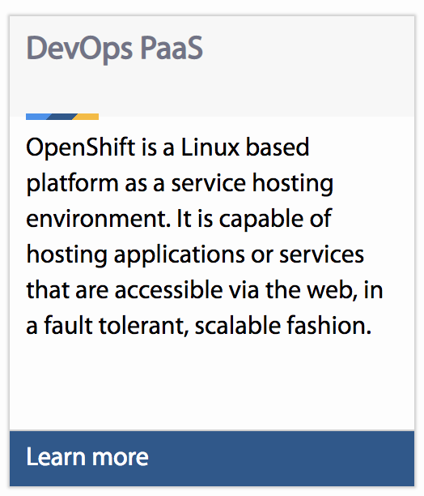

# Registering Your Repo for Devhub

Register your repo so that any markdown files of your choosing will be viewable in the Devhub.

## How To Register Your Repo 
When you register your repository several processes will be kicked off whenever the Devhub App is rebuilt. 

We are still ironing out the best solution for registering.
In the interim please ***fork*** and ***pull request*** to the registry.

Please take a look at the [Registry Template](./registry.sample.yml)
file to get an idea of how you would add your repository to the registry.

In a nutshell it will grab one or more files from your repository, process them, and spit out either a 'card'



or a card and a page (which the card would navigate too when clicked)

## Supported File Types in Devhub
- .md (Markdown)
- .html (HTML)

### Step 1: Include `.devhubignore`

Ensure you have a `.devhubignore` file apart of your repo in the root level of the repo (not within any folders). 

The `.devhubignore` is a configuration file that tells what files the devhub **should not** process. 
This is important as you may not want to reveal documentation files such as READMEs to the devhub.

By default we already exclude the following files and folders so you will not to place the following within your `.devhubignore` file:

- openshift
- CONTRIBUTING.md
- CODE_OF_CONDUCT.md
- LICENSE

Sample .devhubignore file:

```
README.md
/docs/dont_show_this.md
```


### Step 2: Ensuring Your Files Meet Metadata Requirements

Based on what type of file you are choosing to include in the devhub some metadata properties may
be required. 

#### Markdown Metadata

Add Front Matter To Your Markdown Files
> Last updated: Oct 17th 2018

Front matter provides extra information that is necessary for Devhub to know ***how*** to process your markdown files. As definitions change for this process, the requirements for what will be needed for your front matter may change.

>***TL;DR***

**If your markdown content is destined to create a page in the devhub:**

Your markdown file must contain this as apart of its front matter:
```markdown
---
title: what you want as the title
description: short description explaining the content
---
# Your Actual Markdown Content
...
```

**If your markdown content should point to an external resource**
Your markdown file must contain this as apart of its front matter:
```markdown
---
title: what you want as the title
description: short description explaining the content
resourcePath: https://www.toyoursite.com
---
```

Let's get into detail what each of those **things** are used for in the front matter.

#### title (optional)
The title for your file which is used as the title in the card view inside the devhub. If this is not
included, the title will be *inferred* by the first header in your markdown code.

#### description (mandatory)
A short description describing what's in this file. This will be used as the short blurb in the card view inside the devhub. (try to limit to 280 character)

#### resoucePath (optional)
Tells the devhub to point the user to your resource when they click on the devhub resource card
The resourcepath should be a valid hyper link

#### pageOnly (optional)
Set to true if you do not want the content to show up in the homepage as an individual card, the content will still be presented in the page view

#### ignore (optional)
Set to true if you do not want the content to show up at all

#### HTML metadata
In future versions, the Devhub will use the *unfurling* techinique to create neat previews of your
content. Follow this document on how to add the appropriate metadata to your HTML document. 

https://medium.com/slack-developer-blog/everything-you-ever-wanted-to-know-about-unfurling-but-were-afraid-to-ask-or-how-to-make-your-e64b4bb9254

### Step 3: Register your repository

Before your repo's content is taken in by the Devhub, the Devhub needs to know it exists first.
This is accomplished by 'registering' into the devhub.

> Valid Registry Properties:
- `name`  The name you would like to represent your source as in the devhub. This is something user's will see so avoid naming it in an unpresentable way such as
    - bad: `name: 'my-awesome-repo'
    - good: `name: 'My Awesome Repo'
- `sourceType` This tells Siphon how to grab information from your source
    - Valid Source Types:
        - 'github'
- `sourceProperties` These are properties as required for a source type
    - 'github'
        - `url`: the path to your repo
        - `owner`: the owner of the repo    
        - `repo` This is the **actual** repository name
        - `branch` (optional) The branch you would like devhub to source content from
- `resourceType` (optional) This is a global resource type, any singular chunk of data (such as a markdown file or a yaml file or a  link to a website) that Siphon grabs from your source can have it's individual resourceType defaulted to this value
    - valid resource types: see the main readme
This will involve making a [Fork of the Devhub](https://github.com/bcgov/devhub-app-web/fork) and Pull Request to the [Devhub Repository's contributor-repository-registry branch](https://github.com/bcgov/devhub-app-web/tree/contributor-repo-registry).

***PULL REQUESTS TO MASTER OR ANY OTHER BRANCH WILL BE IGNORED***

>If this is your first time Forking and or making Pull Requests, more details can be found [here](https://github.com/bcgov/devhub-app-web/blob/master/CONTRIBUTING.md).


