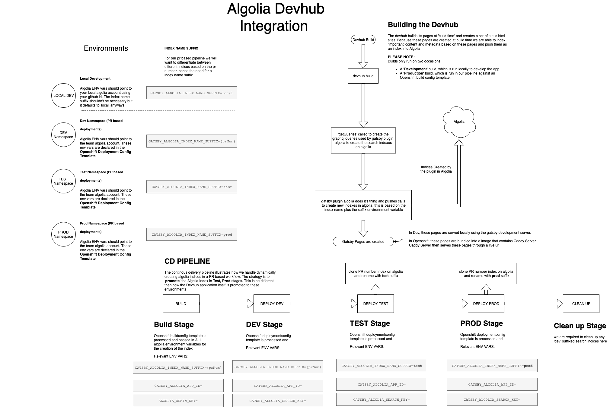

<!-- Please note the above frontmatter is just incase we would want to 'host' this document as a site
in gatsby -->

The Devhub has moved over to leveraging Algolia for its search. In order to develop __locally__, setting
up a personal account with [Algolia](https://algolia.com) is required. The community version of the account is 
free and doesn't require a credit card. Only a valid Github ID is required for loggingin.

The Devhub originally used a __Client-side based__ search engine called `elasticlunr`. While this 
search engine has been working great for the application, there are a few significant cons to leveraging
it.

- There is a lot of overhead required by the browser to store the index.
- The index was built during __build time__ and consumed a ton of resources in our Openshift builds. (10Gb of memory required :( )
- Search relevance was not amazing. Configuring how the index search scoring was done was challenging. 

## Switching to Algolia

Since Algolia is a 3rd party service, you can take a look at the site for more details on it. https://algolia.com.

Some pros: 

- offloading our index to an external source will improve site performance
- improved search relevancy ∝ better ux
- great gatsby plugins to leverage
- great guides on utilizing algolia in gatsby

## Working with Algolia in a PR based pipeline

The PR based pipeline introduced some challenges on how to maintain and utilize our search indexes. 

Some questions arose:

- We create a new deployment for every PR, should we create a new index for every deployment?
- What index should the prod and test deployments use?
- What index should local development use?
- How can we ensure new content is loaded into the index and available at runtime?

## The Solution (...for now)

- Treat algolia workflow the same as the application (treat it like the PR based workflow)
- Have the search index get 'promoted' to test and prod just as the application does
- Cleanup stale indices as they are created
- Local Development should leverage a local Algolia developer account

## Testing algolia based features in a PR based pipeline

- The e2e Cypress testing within Github Actions uses the "Devhub-Algolia-local" index for search.
- For every PR containing a feature or a change to the algolia index, the algolia index based of the PR will have to be cloned to "Devhub-Algolia-local" index

## How does that work again?

Glad you asked. Here is an illustration :)

