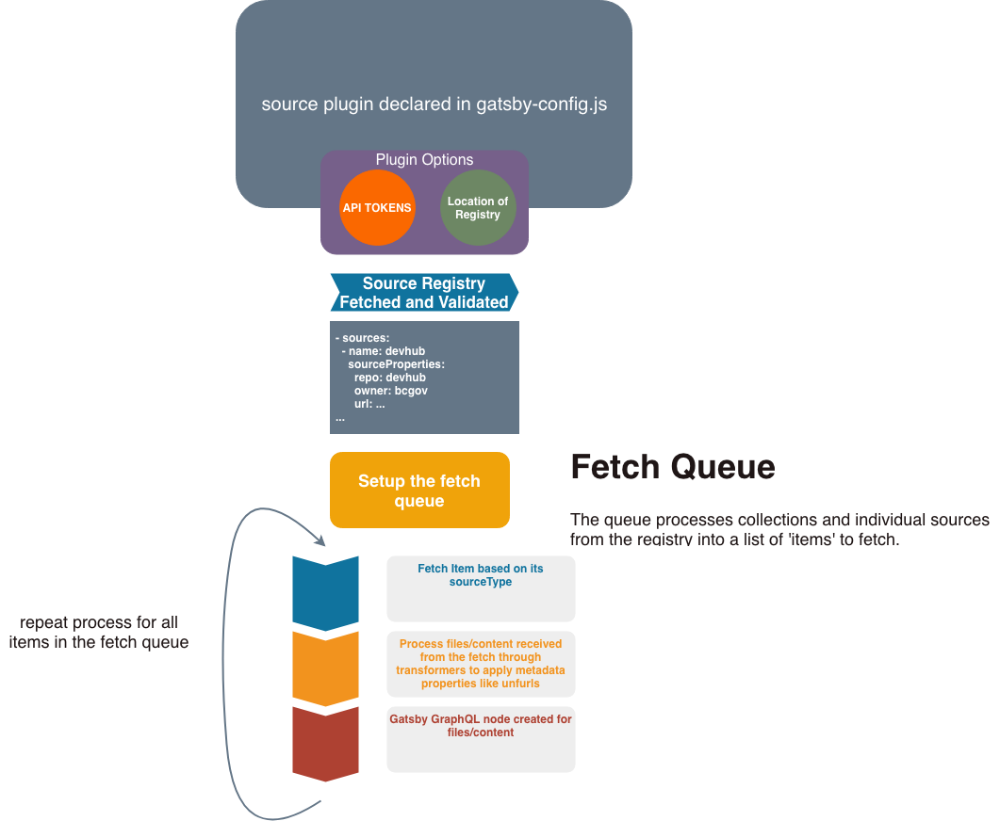
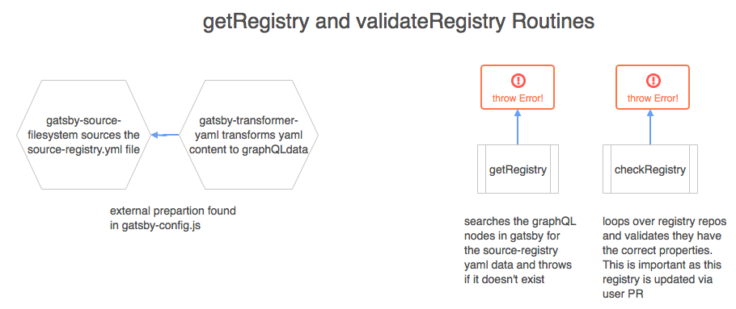
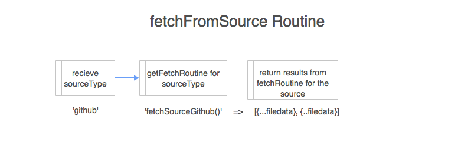
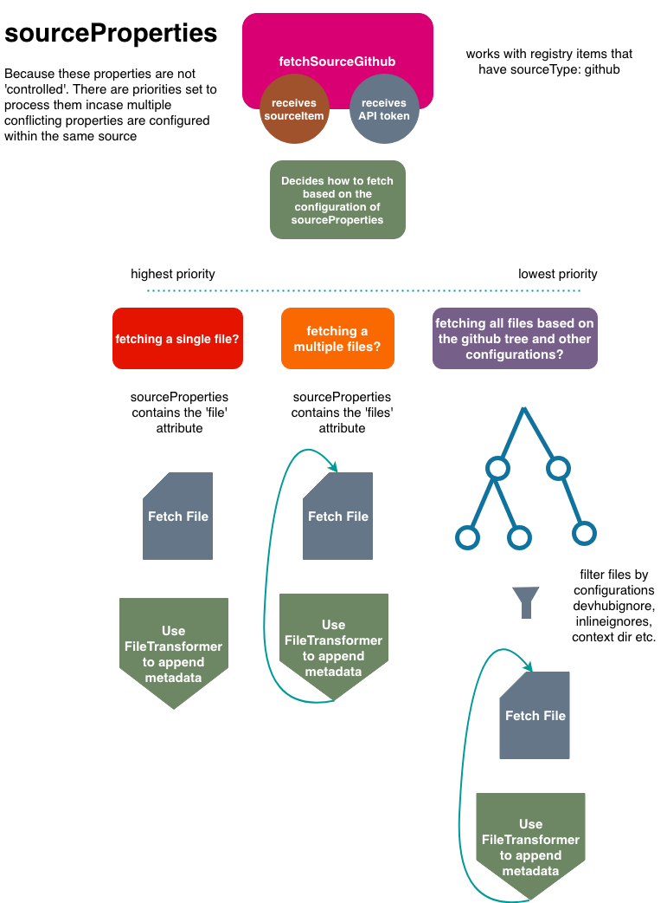
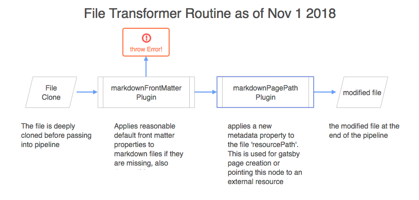

# Siphon
Devhub is a content catalogue generator. **Siphon** is Devhub's main tool that *siphons* content from Github Repositories and converts it into useable Gatsby JS graphQL nodes.

## Table of Contents

-   [Flow Charts](#routine-flow)
    - [Main Routine](#main-routine-flow)
    - [Fetching/Validating The Registry](#registry)
    - [Fetching Files By A Source Type](#fetch-files-from-source)
        - [Fetching Files from Github Repositories repositories](#fetchgithubsource-fetch-files-from-repos)
    - [Transforming Files with the FileTransformer Pipeline](#file-transformer)
-   [Fetching Files By Sources Authoring](#authoring-a-fetch-routine)
-   [File Transfomer Pipeline](#the-file-transformer)
    - [Transfomer Usage](#transformer-usage)
    - [Transformer Plugin Authoring](#transformer-plugin-authoring)
-   [Understanding the Node Structure](#node-structure)
    - [GraphQL Intro](#graphql)
    - [The Siphon GraphQL Schema](#siphons-graphql-schema)
    - [Implicit mediaTypes and other Gatsby Plugins](#implicit-media-types-and-their-importance)

## What is it?
Siphon is actually just a [Gatsby Source Plugin](https://www.gatsbyjs.org/docs/create-source-plugin/) that was locally authored to pull in content from Github Repositories.

## Inspiration
Although there are a couple of publicly available Gatsby Source Plugins to source content from Github, they didn't meet the scale requirements for the devhub. Plugins like [gatsby source graphql](https://www.npmjs.com/package/gatsby-source-graphql) are really only meant to grab sources from a few set of repositories. The only way to get content from repositories at scale would be to dynamically generate graphQL query strings and or dynamically append more instances of the plugin to the `gatsby-config.js` file.

In addition, they lacked the ability to control things like **mime types** for respository content. Which is a very important requirement to allow for github content to be processed by public gatsby transformer plugins without configuration.

## Routine Flow

### Main Routine Flow



### Sub Routines

#### Registry


#### Setting up the Fetch Queue

Siphon treats collections in the **registry** just like any other **source**. If the fetch queue detects
a registry item as a ***collection*** it grabs all the sources **within the collection**, extracts them,
maps the **name** and **other properties** from the collection registry item to them and pushes them into the fetch queue. 

If an items is **not a collection** it is simply pushed into the fetch queue without further processing. 

##### So what is a collection then?
The difference between a 'collection' and a regular 'source' is that *sources within the collection
share the same **name attribute***

Infact an individual source like:
```yaml
- name: My Repo
  sourceType: 'github'
  resourceType: Documentation
  attributes:
    persona: 'Designer'
  sourceProperties:
    repo: foo
    owner: bar
    url: https://github.com/bar/foo
```

Is really just a **special case of a collection**. A ***Source Collection***.
Each individual node that is created from all of the content that is fetched from the above repo
shares the same collection name `My Repo`.

For a 'custom collection', each item could potentially be a repo or an individual file. For all of the
nodes that are created for these sources, instead of their name being set individually, it is
inherited by the `name` attribute that was defined in the registry.

Example Collection Registry Item:
```yaml
- name: My Collection
  resourceType: Documentation
  attributes:
    persona: Developer
  sourceProperties:
    sources:
      - sourceType: github
        sourceProperties:
            repo: foo
            owner: bar
            url: https://github.com/bar/foo
      - sourceType: github
        sourceProperties:
            repo: baz
            owner: bar
            file: README.md
        resourceType: Component
```

Firstly notice how the **individual sources** within the collection do not have the `name` attribute (even if it were there it would be ignored in a collection). Instead, when processed in the `fetchQueue` routine, it inherits the properties set at the top. 

So in the end each individual item would look more like
```yaml
-   name: My Collection
    sourceType: github
    sourceProperties:
        repo: foo
        owner: bar
        url: https://github.com/bar/foo
    resourceType: Documentation
    attributes:
        persona: Developer
-   name: My Collection
    sourceType: github
    sourceProperties:
        repo: baz
        owner: bar
        file: README.md
    resourceType: Component
    attributes:
        persona: Developer
```

Notice how if there were properties that conflicted such as the `resourceType: Component` for the second
source, it took priority. In essence properties in the collection *cascade* down to the child sources, but
if the child sources have properties assigned they take priority (with the exception of name).

Now that we have processed collections and indvidual sources in the registry as the **same thing**
they can be processed exactly the same way :)

#### Fetch Files From Source

Sources are fetched based on their source type. The source type is mapped against 
a fetching function which returns a normalized datastructure on return.



##### Fetching Functions

###### fetchGithubSource


#### File Transformer



## Authoring A Source Fetch Routine

Because Siphon has the ability to collect data from several sources it is important that
when sources are *sourced* they return a standardized object which Siphon can then use to create
nodes. Currently the standardized object is just a plain javascript object but future implementations
would more than likely involve an instance of a **Class the implements a Source Interface**.

### Things to Consider

- Have you added to the `SOURCE_TYPES` constant the source you are attempting to fetch?
- Have you created a validation function to validate the `sourceProperties` that are made available to your source
from the source registry?
- Have you created a fetch routine that returns the standard metadata required (see the githubsource fn for more info)

## The File Transformer

Transforming files sourced by **Siphon**

There is a transformer routine that can sift through files to further transform the raw file data
prior to creating the graphql node.

Reasons for the transfomer routine:

I spent many hours working on how to accomplish a similar task within preexisting gatsby plugins to find
that either it was not possible or went against the grain of that plugin's purpose. The transformer routine
can better thought of as data massaging utility more than anything. It is 100% particular to the local
source plugin and so I felt it didn't fit the needs of being a fully isolated gastby plugin. The **Primary**
purpose of this transformer is to set up reasonable default configurations for files and or apply metadata based on file content.
The initial release was for providing default front matter properties.

### Transformer Usage

The transfomer is a simple pipeline. It recieves a file and passes it through different pipelines, each
that modify the content before passing into the next pipeline.

It's usage:
```
const { fileTransformer } = require(...);

const transformedFile = fileTransformer(extension, file)
      .use(markdownPlugin)
      .use(anotherPlugin)
      .use(anotherPlugin)
      .resolve(); // returns the file
```
### Transformer Plugin Authoring
***not to be confused with a gatsby-transformer plugin!!!***
Plugins should be written in [plugins.js](../app-web/plugins/gatsby-source-github-all/utils/plugins.js).
Unless there is a time the file is too cumbersome and seperating the plugins into seperate files is necessary.

Plugins receive all files that were fetched inside of the repo. For that reason, it is ***recommended***
that you check for the file type (by extension) before modifying the content. In any case the content property
***must*** be returned for the pipeline to continue.

The plugin format should be:

```javascript
    const pluginName = async (extension, file, options) => {
        return file;
    }
```
> Parameters
- extension: This is the file extension ie 'md', 'txt', 'json', 'yaml', 'yml'
    - you may only want to modify content of a particular file type
    - in any case the content MUST be returned regardless of any conditions in your code
- file: This is the file that your plugin will transform, the obj contains everything that is received from [Github API 3 Contents](https://developer.github.com/v3/repos/contents/#get-contents) plus additional data
    ```javascript
    // sample file
    {
    ...ContentsAPIData,
      content: String,
      metadata: {
        labels: Array,
        sourceName: String,
        source: String,
        owner: String,
        name: String,
        fileType: String,
        fileName: String,
        mediaType: String,
        extension: String,
        sourceURL: String,
      },
    }
      ```
- options: an optional object passed into the transformer pipline

It's usage would be...

```javascript
// pipeline.js
const yamlPlugin = async (extension, file, { dateLoaded }) => {
    if(extension === 'yaml' || extension === 'yml') {
        // do something to content
        const yaml = YAML.parse(file.internal.content);
        // apply new property
        yaml.dateLoaded = dateLoaded;
        file.content = YAML.stringify(yaml);
        return file;
    }
    return file;
}

// sourceNodes.js
const date = Date.now();
const content = await fileTransformer(extension, file)
    .use(markdownPlugin)
    .use(yamlPlugin, { dateLoaded: date })
    .resolve();
```

> note how async/await is used in the transformer and plugins

## Node Structure

Siphon's endgame is to create graphQL nodes based on the files it pulls from github repositories. As
this is a **Gatsby Source Plugin** there are a few conventions that are required to follow when creating
the graphQL schema (more on that [here](https://www.gatsbyjs.org/docs/plugin-authoring/))

### GraphQL

[Gatsby uses GraphQL](https://www.gatsbyjs.org/docs/graphql/) as a datalayer to render content to a Gatsby Page.

### Siphon's GraphQL Schema
> last updated Dec 7th 2018

```javascript
    id, // unique identifier for node
    children // initiall this is an empty array but is populated by transformer plugins
    fileName // full file name
    fileType // the pretty printed name of the file type if exists, .md => Markdown, .yml => YAML, .json => JSON
    name // the file name minus extension
    owner // owner of resource
    parent // gatsby required attribute, this is null
    path // path to the resource
    collection {
        name // name of the collection, this is directly related to the name attribute in the registry
        type // this is an enumeration that is automatically assigned by siphon, values being 'curated' or 'soure'
    }
    // unfurl is data used to provide 'previews' for the node
    // this adopts standards from twitter cards, open graph
    // and other standard properties from other specs
    unfurl {
        description,
        title,
        image,
        label1,
        data1,
        label2,
        data2,
        type,
        author
    }
    source {
        name // the actual repository name as found in github
        displayName // pretty name for the source which is inherited by the name property in the source-registry.yml
        sourcePath // the URL to the repository
        sourceType // the type of the source ie (github, website etc) 
    }
    resource {
        type // the resource types, (Documentation, People, Projects, Repositories, Components, Self-Service-Tools)
        // pointer to the resource for this node. This may be external, a link to another website
        // or internal, a link to a generated gatsby page
        path 
        originalSource
    }
    attributes { // extra information that may be beneficial for searching
        labels
        persona
    }
    internal {
        contentDigest // a gatsby required property
        // Optional media type (https://en.wikipedia.org/wiki/Media_type) to indicate
        // to transformer plugins this node has data they can further process.
        mediaType // media type is implicity set by the file extension
        type // globally unique type used to identify this node from other nodes that may exist in the datalayer
        // Optional field exposing the raw content for this node
        // that transformer plugins can take and further process.
        content // raw content of file
    }
```
#### Key Takeaways

-   Each Node contains paths to the originating repository source
-   Each Node contains paths to the file's originating source
-   Each Node contains *metadata* components like file types and file name
-   Nodes have labels which can be used for a filtering implementation
-   Nodes ***mediaType*** is implicitly set based on the ***fileType***

### Implicit Media Types and their Importance

Gatsby has a set of plugins called [Transformers](https://gatsbyjs.org/tutorial/part-six/). Which
are a very powerful and *slightly* automagical way of modifying or interpreting content.

All transformers (as far as I've seen in the source code for plugins) base their transformations
on the nodes `mediaType`.

Because Siphon's Schema follows the Gatsby conventions with the internal `mediaType` and `content`
properties, 3rd party transformer plugins are able to transform them, create child nodes and attach
those child nodes to the Siphon node.

**Example**

Using the Siphon Source Plugin and Gatsby Transformer Remark Plugin (a 3rd party plugin).

Siphon Sources a markdown file and creates a graphQL node for it with the following data

```
//siphon graphql data
{
    "id": "123",
    "name": "about",
    "sourceName": "Design System",
    "resourcePath": "/design-system/about_R4mC3Sp_T",
    "source": "design-system",
    ...more properties
    "children": [],
    "internal": {
        ...more properties
        "mediaType": "text/markdown"
        "content": "---\nsomefrontmatter: yes\n---\n# Hello World"
    }
}
```

Gatsby Transformer Remark Will pick up this node because of the `"mediaType": "text/markdown"`
and apply some transformations

```
// siphon graphql data after remark transformation
{
    "id": "123",
    "name": "about",
    "sourceName": "Design System",
    "resourcePath": "/design-system/about_R4mC3Sp_T",
    "source": "design-system",
    ...more properties
    "children": [
        {
            "id": "sadf-123sadkja-3as >>> MarkdownRemark"
        }
    ],
    "childMarkdownRemark": {
        "html": "<h1>Hello World</h1>",
        "frontmatter": {
            "title": "the Title"
        }
    }
    "internal": {
        ...more properties
        "mediaType": "text/markdown"
        "content": "---\ntitle: the title\n---\n# Hello World"
    }
}
```

We can see that the remark transformer plugin ***provided*** some extra utility to the Siphon node.

***CAUTION!***

Just becuase the transformer remark plugin appended a "childMarkdownRemark" property  doesn't mean other transformer plugins will behave similarily!
