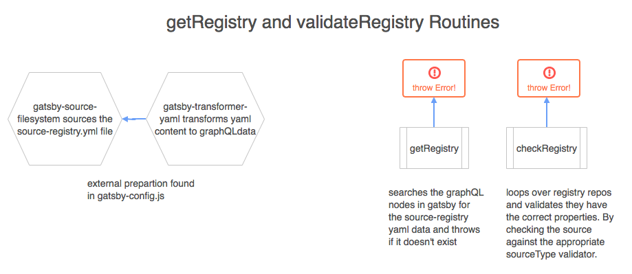

# Siphon
Devhub is a content catalogue generator. **Siphon** is Devhub's main tool that *siphons* content from Github Repositories and converts it into useable Gatsby JS graphQL nodes.

## Table of Contents

-   [Flow Charts](#routine-flow)
    - [Main Routine](#main-routine-flow)
    - [Fetching/Validating The Registry](#registry)
    - [Fetching Files from repositories](#fetch-files-from-repo)
    - [Transforming Files with the FileTransformer Pipeline](#file-transformer)
-   [Understanding the Node Structure](#node-structure)
    - [GraphQL Intro](#graphql)
    - [The Siphon GraphQL Schema](#siphons-graphql-schema)
    - [Implicit mediaTypes and other Gatsby Plugins](#implicit-media-types-and-their-importance)

## What is it?
Siphon is actually just a [Gatsby Source Plugin](https://www.gatsbyjs.org/docs/create-source-plugin/) that was locally authored to pull in content from Github Repositories.

## Inspiration
Although there are a couple of publicly available Gatsby Source Plugins to source content from Github, they didn't meet the scale requirements for the devhub. Plugins like [gatsby source graphql](https://www.npmjs.com/package/gatsby-source-graphql) are really only meant to grab sources from a few set of repositories. The only way to get content from repositories at scale would be to dynamically generate graphQL query strings and or dynamically append more instances of the plugin to the `gatsby-config.js` file.

In addition, they lacked the ability to control things like **mime types** for respository content. Which is a very important requirement to allow for github content to be processed by public gatsby transformer plugins without configuration.

## Routine Flow

### Main Routine Flow


### Sub Routines

#### Registry


#### Fetch Files From Repo


#### File Transformer


## Node Structure

Siphon's endgame is to create graphQL nodes based on the files it pulls from github repositories. As
this is a **Gatsby Source Plugin** there are a few conventions that are required to follow when creating
the graphQL schema (more on that [here](https://v1.gatsbyjs.org/docs/source-plugin-tutorial/))

### GraphQL

[Gatsby uses GraphQL](https://v1.gatsbyjs.org/docs/querying-with-graphql/) as a datalayer to render content to a Gatsby Page.

### Siphon's GraphQL Schema
> last updated Nov 2 2018

```javascript
    id, // unique identifier for node
    children // initiall this is an empty array but is populated by transformer plugins
    fileName // full file name
    fileType // the pretty printed name of the file type if exists, .md => Markdown, .yml => YAML, .json => JSON
    name // the file name minus extension
    owner // repo owner
    parent // gatsby required attribute, this is null
    path // path to the file relative to the respository
    originalSource // the original URL to the file
    source // the actual repository name as found in github
    sourceName // pretty name for the source which is inherited by the name property in the source-registry.yml
    sourcePath // the URL to the repository
    resourcePath
    // pointer to the resource for this node. This may be external, a link to another website
    // or internal, a link to a generated gatsby page
    labels
    // this is a combination of globally set labels (found in source registry.yml) and any implicity
    // found by other mechanisms (when sifting through the content). Labels is planned to be used for
    // filtering nodes on the client
    internal {
        contentDigest // a gatsby required property
        // Optional media type (https://en.wikipedia.org/wiki/Media_type) to indicate
        // to transformer plugins this node has data they can further process.
        mediaType // media type is implicity set by the file extension
        type // globally unique type used to identify this node from other nodes that may exist in the datalayer
        // Optional field exposing the raw content for this node
        // that transformer plugins can take and further process.
        content // raw content of file
    }
```
#### Key Takeaways

-   Each Node contains paths to the originating repository source
-   Each Node contains paths to the file's originating source
-   Each Node contains *metadata* components like file types and file name
-   Nodes have labels which can be used for a filtering implementation
-   Nodes ***mediaType*** is implicitly set based on the ***fileType***

### Implicit Media Types and their Importance

Gatsby has a set of plugins called [Transformers](https://v1.gatsbyjs.org/tutorial/part-six/). Which
are a very powerful and *slightly* automagical way of modifying or interpreting content.

All transformers (as far as I've seen in the source code for plugins) base their transformations
on the nodes `mediaType`.

Because Siphon's Schema follows the Gatsby conventions with the internal `mediaType` and `content`
properties, 3rd party transformer plugins are able to transform them, create child nodes and attach
those child nodes to the Siphon node.

**Example**

Using the Siphon Source Plugin and Gatsby Transformer Remark Plugin (a 3rd party plugin).

Siphon Sources a markdown file and creates a graphQL node for it with the following data

```
//siphon graphql data
{
    "id": "123",
    "name": "about",
    "sourceName": "Design System",
    "resourcePath": "/design-system/about_R4mC3Sp_T",
    "source": "design-system",
    ...more properties
    "children": [],
    "internal": {
        ...more properties
        "mediaType": "text/markdown"
        "content": "---\nsomefrontmatter: yes\n---\n# Hello World"
    }
}
```

Gatsby Transformer Remark Will pick up this node because of the `"mediaType": "text/markdown"`
and apply some transformations

```
// siphon graphql data after remark transformation
{
    "id": "123",
    "name": "about",
    "sourceName": "Design System",
    "resourcePath": "/design-system/about_R4mC3Sp_T",
    "source": "design-system",
    ...more properties
    "children": [
        {
            "id": "sadf-123sadkja-3as >>> MarkdownRemark"
        }
    ],
    "childMarkdownRemark": {
        "html": "<h1>Hello World</h1>",
        "frontmatter": {
            "title": "the Title"
        }
    }
    "internal": {
        ...more properties
        "mediaType": "text/markdown"
        "content": "---\ntitle: the title\n---\n# Hello World"
    }
}
```

We can see that the remark transformer plugin ***provided*** some extra utility to the Siphon node.

***CAUTION!***

Just becuase the transformer remark plugin appended a "childMarkdownRemark" property  doesn't mean other transformer plugins will behave similarily!
