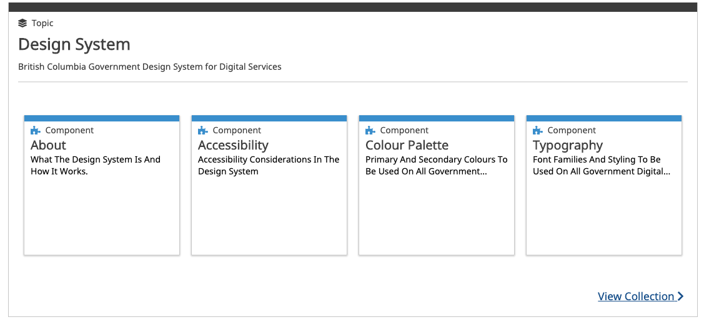

### Who should use this application?

This application is geared towards developers working on digital products within the B.C. Government (with a focus on Agile Development), however there is useful information for anyone interested in the B.C. Government digital landscape.

### What is the Devhub and how does it work?

The Devhub is a content aggregator application. It leverages modern tooling and frameworks to source content across different types of media. This media can be from a markdown file within a Github Repository, a link to a website, events from 3rd party providers and more. We are working towards expanding the types of media Devhub supports to make it immersive, and useful in your workflow.

Whenever the Devhub is refreshed in production (the live public facing website), it seeks out all the content that it's subscribed too and pulls it into the application.

### What is the problem Devhub is trying to solve?

Whether you are a developer working on a new or existing project; a designer looking for tested specifications on UI components, a product owner seeking resources for cloud native development or anyone else who is just interested in the B.C. Government digital world and want to learn more, finding the things you need to get your work done can be hard. 

The digital landscape is constantly changing and improving. This can be challenging to keep up with if the platform for guidelines and policies is a static Word document or PDF. 

In addition, static guidance loses out on key information that is useful whenever working with digital products such as: 

- who authored this content?  
- when was it last updated?  
- are other teams using this guidance? 
  

In other words, can the guidance be trusted as complete, relevant, and useful?

An additional problem the Devhub is working towards solving is spurring a community around digital workflows and products. This includes events. Events in government can be scattered along different platforms which can make them difficult to discover, share and manage.

### How Devhub aims to solve these problems

The Devhub aims to solve these problems by:
 
- providing a platform that ‘centralizes’ all relevant content related to agile product development within government 
- maintains useful links between content such as: who the content may be geared towards, the author of the content, date of last update etc.  
- engageing the community to continuously improve guidelines, policies and even Devhub itself through the Github platform.  
- Make it easy and intuitive to find what you need to get your job done

## Devhub Concepts/How to use
> Although not necessary to explore the Devhub, many features of this application are closely tied to https://github.com, a social code repository platform. Some features may provide a better experience if you have a github user account.

To make it easier to navigate and discover content, we have _specially grouped_ content
into relatable ___Topics___.

Feel free to explore the different topics that we have specially curated by by clicking the __Topics__ link from within the header.

Each __Topic__ consists of one or more __Resources__ related to that topic. A __Resource__ can come in
many forms depending on what it is about. We have identified a few common themes when it comes to types
of resources. These are:

### Documentation

Documentation is the most straightforward type of resource.  

Documentation would include any type of guide, how-to, reference, manual, or FAQ relevant to designers or developers.  
Documentation may exist in Markdown, HTML, PDF, and Word/Office formats, among others.  
Documentation may be sourced from GitHub, other government websites, or external websites.

### Github Repositories

Github Repositories correspond directly to the [B.C. Government repository on GitHub](https://github.com/bcgov). Resources that
are of type 'Github Repository' will allow you to directly access/reference/contribute to the repoositories
codebase.  

### Components

Components are the reusable building blocks for digital products. Designers and developers can use these components as they design and build new products to reduce the effort required, improve consistency, and ensure compliance.

Components in the DevHub would include visual components, code libraries, microservices, code snippets or templates. They are either produced or managed by or for government.

### Tools

Tools provide the means for developers to provision, configure, and track the shared services operated by the DevOps Platform Services Team and others as part of their development processes or production applications.

__Many of these__ tools are hosted outside of the Devhub.

### Exploring 

There are several ways you can explore content through the Devhub. Some of the primarys ways include

- Search: searching is accomplished via an internal search engine. It is really good and really fast. 
- Filtering: filter resources based on relevant topics such as _who is the content geared towards?_
- Viewing a Topic: Whenever you click on a topic you get to view the topic plus all of the individual resources
that make up the topic. 

### How to Suggest new content for the Devhub

New content can be added to the Dehub, by either suggesting a new topic or editing an existing topic.

  - Suggesting a new topic: You can find the `Suggest New Topic ` button on the topics page.

    Clicking the button re-directs you to a form. The form requires the users to enter essential information regarding the topic and lets, them add
    multiple sources within a topic. Upon submitting the form a pull request is generated to suggest a new topic. The link for the pull request appears on the
    same page once the pull request is created.

  - Suggesting an edit to topic: You can find the `Suggest An Edit ` button for each topic on the respective topic landing page.
  
    Clicking the button re-directs you to a prepopulated form with data corresponding to the topic. You can either make changes to the existing data or add new sources for the topic. Upon submitting the form, a pull request is created to incorporate new changes to the topic. The link for the pull request appears on the same page, once it is generated.

    A member from the Platform Services team, will then review the pull request. Once approved, your suggested content will show up on the devhub under
    the respective topic.
  

### When There's a Problem

We are continously improving Devhub as a whole. If there is anything wrong with the Devhub or the content within it, you may raise an issue via a few mechanisms. 

#### When There's a Problem With a Resource

You can find a button to raise an issue in Github for that content. This will make the issue public and known
to the author's of that resoruce. 

#### When There's a Problem With Devhub

You can raise an issue within the [Devhub Repository](https://github.com/bcgov/devhub-app-web/issues)
